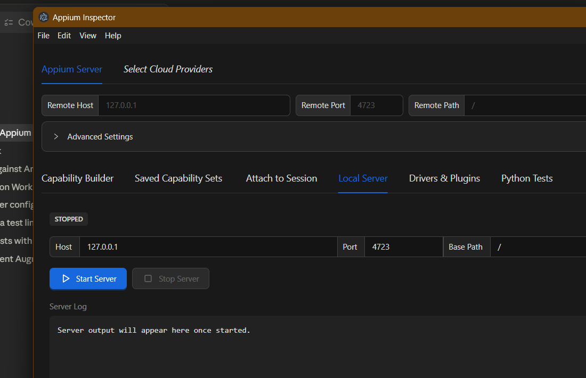
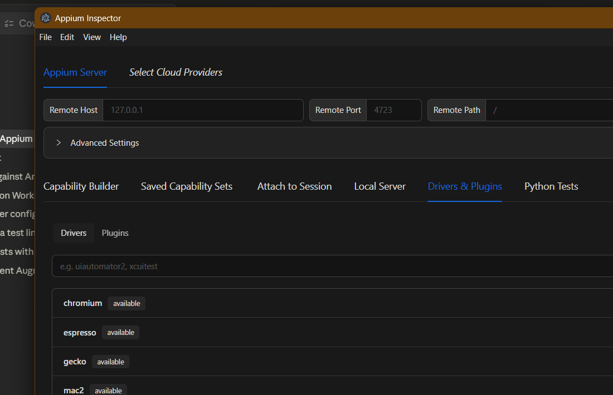
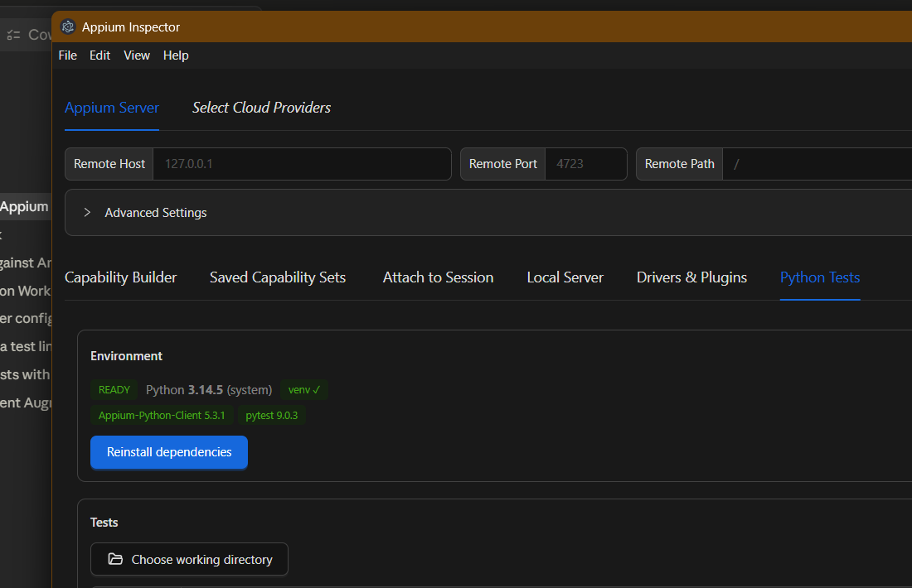
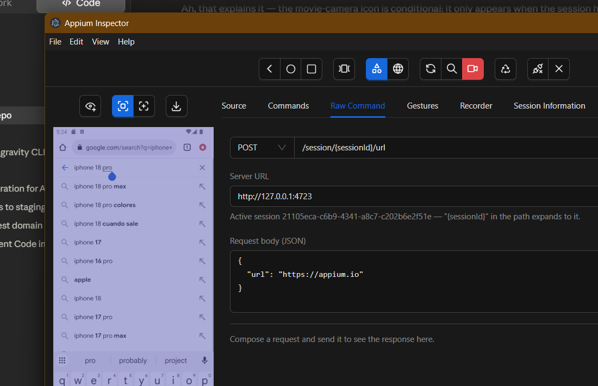

# All-in-One Appium Inspector

This fork extends the standard [Appium Inspector](https://github.com/appium/appium-inspector)
into a self-contained desktop app. From the GUI you can:

1. **Run a bundled Appium server** — start/stop a server that ships *inside* the
   app; no separate `npm i -g appium` required.
2. **Manage drivers & plugins** — install / update / uninstall / doctor Appium
   extensions into an app-private home.
3. **Author & run Python tests** — detect Python, build an isolated virtualenv,
   install `Appium-Python-Client` + `pytest`, pick a working directory, and run
   pytest with streamed output and a parsed pass/fail summary.
4. **Fire raw WebDriver commands** — a Postman-style panel that talks straight to
   the server's WebDriver endpoints, riding the live session.

Everything else (capability builder, inspector, gestures, recorder, etc.) works
exactly as upstream. Python is the only supported test-authoring language.

---

## 1. Where the features live in the UI

All new UI is gated to the **desktop app** (it needs the Electron IPC bridge),
so the browser build is unchanged.

| Feature | Where to find it |
|---|---|
| **Local Server** | Start screen → lower tab row → **Local Server** |
| **Drivers & Plugins** | Start screen → lower tab row → **Drivers & Plugins** |
| **Python Tests** | Start screen → lower tab row → **Python Tests** |
| **Raw Command** | Inside a live session → inspector tab → **Raw Command** |

The lower tab row is the one that also holds *Capability Builder / Saved
Capability Sets / Attach to Session*.

### Screenshots

> These images live in [`docs/assets/all-in-one/`](docs/assets/all-in-one/). To
> (re)generate them, launch the app, navigate to each tab, and run the capture
> helper once per panel:
>
> ```powershell
> powershell -ExecutionPolicy Bypass -File scripts/capture-screenshot.ps1 -Name local-server
> powershell -ExecutionPolicy Bypass -File scripts/capture-screenshot.ps1 -Name drivers-plugins
> powershell -ExecutionPolicy Bypass -File scripts/capture-screenshot.ps1 -Name python-tests
> powershell -ExecutionPolicy Bypass -File scripts/capture-screenshot.ps1 -Name raw-command
> ```

**Local Server**



**Drivers & Plugins**



**Python Tests**



**Raw Command** (inside a live session)



### Typical first run

1. **Local Server → Start Server.** Status goes `stopped → starting → running`.
   The badge shows the source: `bundled` (shipped with the app) or `system`
   (an `appium` found on your PATH).
2. **Drivers & Plugins → Drivers → install `uiautomator2`** (or `xcuitest` on
   macOS). It streams the install log, then refreshes the list.
3. Build your capabilities in **Capability Builder** as usual and **Start
   Session** against `http://127.0.0.1:4723`.
4. (Optional) **Python Tests → Set up environment**, choose a working directory,
   and **Run tests**.

---

## 2. Architecture

The design follows five principles:

1. **One process runner.** A single main-process module
   ([`process-runner.js`](app/electron/main/process-runner.js)) spawns child
   processes and streams their output to the renderer over IPC. The Appium
   server, the extension CLI, `pip`, and `pytest` are all just callers of it.
2. **Resolution is isolated.**
   [`binary-resolver.js`](app/electron/main/binary-resolver.js) is the single
   place that decides where each external tool lives (user-configured path →
   bundled under `resourcesPath` → system PATH).
3. **Constrained IPC.** The renderer sends *intent* (e.g. `{type, name}`), never
   an executable or free-form args. The main process validates and builds every
   command from fixed templates. The one general-purpose "spawn anything"
   channel is **dev-only**.
4. **Isolation.** Drivers/plugins install into an app-scoped `APPIUM_HOME`;
   Python deps install into an app-scoped venv. Both live under Electron's
   `userData`.
5. **Two execution models, kept separate.** The inspector session and the Raw
   Command panel share **one** WebDriver session over HTTP. The Python runner
   spawns pytest, which opens its **own** session. Server/extension management
   touches the server *process*, not a session.

### Data flow (every feature follows this shape)

```
React hook (renderer)
  └─ window.electronIPC.<namespace>.<method>()     ← preload.mjs (the bridge)
       └─ ipcMain.handle('<domain>:<action>')      ← registered in helpers.js
            └─ feature module (main process)        ← validates intent
                 └─ process-runner.startProcess()   ← shell:false spawn
                      └─ 'process:output' / 'process:exit' events stream back
```

Long-running output (server log, install log, pytest output) all rides the
shared `process:output` channel; each hook filters by the `runId` it owns.

### The three relationships with the server

Same server underneath, three separate relationships — kept legible in the UI:

1. **Inspector session + Raw Command** → share one live session over HTTP.
2. **Python test runner** → pytest opens its own session.
3. **Server + driver/plugin management** → operate the server process / its
   extensions, not any session.

---

## 3. Feature reference

### 3.1 Local Server

- **UI:** [`SessionBuilder/LocalServerTab/LocalServer.jsx`](app/common/renderer/components/SessionBuilder/LocalServerTab/LocalServer.jsx)
- **Hook:** [`use-appium-server.jsx`](app/common/renderer/hooks/use-appium-server.jsx) → `{state, log, start, stop}`
- **Main:** [`appium-server.js`](app/electron/main/appium-server.js), [`appium-launch.js`](app/electron/main/appium-launch.js)
- **IPC:** `appium:start` (handle), `appium:stop` (send), `appium:getState` (handle); status pushed on `appium:status`.

Manages a single server with a status lifecycle: `stopped → starting → running →
stopping → error`. On start it spawns the server through the process runner,
then polls `<baseUrl>/status` until it returns HTTP 200 (30s timeout) before
flipping to `running`. Defaults: host `127.0.0.1`, port `4723`, base path `/`,
`--allow-cors` enabled (required by the Raw Command panel and browser-context
calls).

The server and the extension CLI share the same `APPIUM_HOME`
(`<userData>/appium-home`), so the server actually *sees* the drivers/plugins
you install in the GUI.

The managed server also starts with `--allow-insecure=*:session_discovery` (the
`*:` scope is required by Appium 3) so the
**Attach to Session** tab can enumerate running sessions (`GET /appium/sessions`)
— otherwise Appium 3 refuses that call and floods the log with
`Potentially insecure feature 'session_discovery' has not been enabled`. This is
safe here because the server is bound to loopback; session enumeration is only
reachable by local processes. (Configurable via the `insecureFeatures` array in
`appium-server.js`.)

> **Security:** `--allow-cors` is safe only on a loopback host. The panel shows a
> warning if you change the host to anything non-loopback — binding CORS to a
> public address reproduces the old Appium Desktop RCE class.

### 3.2 Drivers & Plugins

- **UI:** [`SessionBuilder/ExtensionsTab/Extensions.jsx`](app/common/renderer/components/SessionBuilder/ExtensionsTab/Extensions.jsx)
- **Hook:** [`use-appium-extensions.jsx`](app/common/renderer/hooks/use-appium-extensions.jsx) → `{items, loading, op, opLog, confirm, clearConfirm, refresh, install, update, uninstall, doctor}`
- **Main:** [`appium-extensions.js`](app/electron/main/appium-extensions.js)
- **IPC:** `extensions:list | install | update | uninstall | doctor` (all handle).

A hardened wrapper over `appium {driver|plugin} {list|install|update|uninstall|doctor}`.
The list view distinguishes **installed** (shows version, with Update / Doctor /
Uninstall actions) from **available** (Install action). The kind toggle switches
between drivers and plugins; each kind gets its own hook instance.

**Install gate (security):**

| Input | Behaviour |
|---|---|
| Official short-name (e.g. `uiautomator2`) | Installs directly, no source flag. |
| Unknown short-name | Returns `needs_confirmation` (`not_official`) → panel asks before installing from npm. |
| Explicit `source` without consent | Returns `needs_confirmation` (`third_party`) → panel asks. |
| `source: npm` (validated spec) / `github` (validated `https://github.com/...` URL) | Allowed after consent. |
| `source: git` / `local` | **Refused** — highest-risk vectors. |

Names are matched against a strict regex and may never start with `-`
(argument-injection guard). Major-version updates require an explicit
`unsafe: true`. Installs land in `<userData>/appium-home`.

### 3.3 Python Tests

- **UI:** [`SessionBuilder/PythonTab/PythonPanel.jsx`](app/common/renderer/components/SessionBuilder/PythonTab/PythonPanel.jsx)
- **Hooks:** [`use-python-env.jsx`](app/common/renderer/hooks/use-python-env.jsx), [`use-python-tests.jsx`](app/common/renderer/hooks/use-python-tests.jsx)
- **Main:** [`python-env.js`](app/electron/main/python-env.js), [`python-tests.js`](app/electron/main/python-tests.js)
- **IPC:** `python:status | detect | createVenv | installDeps | pickWorkingDir | listTests | readFile | saveFile | run`; results on `python:result`.

**Environment.** Detects a system Python (≥ 3.9 required), then manages an
app-scoped virtualenv at `<userData>/python-env/venv`. "Set up environment"
chains *create venv → install deps* as one logical operation, streaming both
phases into one log. Managed packages: `Appium-Python-Client`, `pytest` (left
unpinned so pip picks a version compatible with your interpreter). Installing
anything beyond that set requires explicit third-party confirmation.

**Tests.** Pick a working directory via a native dialog (re-validated in the
main process; all file IO is confined to it with a path-traversal guard). The
panel lists `.py` files, takes an optional pytest `-k` keyword filter, and runs:

```
<venvPython> -m pytest [paths] [-k kw] -o junit_family=xunit2 --junit-xml=<tmp>
```

with `cwd` set to the working directory. On exit the JUnit XML is parsed (via
`fast-xml-parser`) into a structured summary — totals (passed / failed / errors
/ skipped / time) plus a per-test list — emitted on `python:result`. If the
report can't be parsed, the run still reports pass/fail by exit code.

**Editor.** Click a file in the list to open it in an in-app editor, or type a
name and hit **New test** for a fresh skeleton. The **Format** button wraps
loose recorded steps into a complete, runnable test — it guarantees the standard
imports a `def test_*` function and `try/finally` driver setup/teardown, with
your action lines indented in the `try` block. It scans the steps and adds the
imports they actually use — `webdriver`/`UiAutomator2Options` always, plus
`AppiumBy`, `ActionChains`, `ActionBuilder`, `PointerInput`, `interaction`, or
`WebDriverWait` when referenced (the usual causes of a `NameError` in raw
recorder output, including gesture/W3C-action code).
Format is **clean by default** (no waits — added waits "just to be safe" bloat
tests and mask real failures); the button's dropdown offers **Format + implicit
wait (10s)** as an explicit opt-in for flows that need load time. **Save** writes
via the confined `python:saveFile` IPC (`.py` only); **Save & run** saves then
runs just that file. (Re-formatting an already-formatted test is idempotent — the
wait line is regenerated, so toggling the option on/off is clean.)

> Python is **never bundled** — Electron can't ship an interpreter cleanly. The
> app detects yours and builds the venv on demand.

### 3.4 Raw Command

- **UI:** [`SessionInspector/RawCommandTab/RawCommand.jsx`](app/common/renderer/components/SessionInspector/RawCommandTab/RawCommand.jsx)
- No hook, no IPC, no main module — **renderer-only.**

A Postman-style panel: pick a method (GET/POST/DELETE), a path, and an optional
JSON body, and it `fetch()`es straight to the WebDriver endpoint. It works
locally because the managed server runs with `--allow-cors`. It reads
`props.driver.sessionId` and `props.serverDetails` to prefill the base URL, and
`{sessionId}` in the path expands to the live session id.

Example: `POST /session/{sessionId}/url` with body `{"url":"https://appium.io"}`
navigates the session.

### 3.5 Recorder → Save As

- **UI:** [`SessionInspector/RecorderTab/Recorder.jsx`](app/common/renderer/components/SessionInspector/RecorderTab/Recorder.jsx)
- **Main:** [`code-export.js`](app/electron/main/code-export.js) — IPC `code:saveAs`.

The Recorder already generates client code in the selected framework. A **Save
As…** split-button writes that code to a file via a native Save dialog: the main
button saves in the currently-selected language, and the dropdown lets you save
as **any** of the 8 supported frameworks directly, each with the right extension
(`.py`, `.java`, `.cs`, `.js`, `.rb`, `.robot`). The destination is chosen
through the OS dialog (no renderer-supplied paths), so you can drop a Python test
straight into your Python Tests working folder and run it — record → save → run,
no copy-paste.

---

## 4. File map

### New files

**Main process** (`app/electron/main/`)
| File | Responsibility |
|---|---|
| `process-runner.js` | Generic spawn + stream over IPC; `collectProcess`; dev-gated `process:start`; `killAllProcesses`. |
| `binary-resolver.js` | Locate `appium` / `python` (configured \| bundled \| system). |
| `appium-launch.js` | Shared `appium` command builder + isolated `APPIUM_HOME`. |
| `appium-server.js` | Server lifecycle: start/stop, readiness poll, status. |
| `appium-extensions.js` | Hardened driver/plugin management. |
| `python-env.js` | Interpreter detect, venv creation, pip installs. |
| `python-tests.js` | Working-dir IO + pytest run + JUnit parsing. |
| `code-export.js` | Save recorder-generated code to a file via a native Save dialog. |

**Renderer** (`app/common/renderer/`)
| File | Responsibility |
|---|---|
| `hooks/use-process-runner.jsx` | Generic runner hook (dev/diagnostic). |
| `hooks/use-appium-server.jsx` | Server status/log + start/stop. |
| `hooks/use-appium-extensions.jsx` | Extension list + mutations + consent. |
| `hooks/use-python-env.jsx` | Env status + `setup()` chain. |
| `hooks/use-python-tests.jsx` | Working dir, files, run, results. |
| `components/SessionBuilder/LocalServerTab/LocalServer.jsx` (+ `.module.css`) | Server control panel. |
| `components/SessionBuilder/ExtensionsTab/Extensions.jsx` (+ `.module.css`) | Drivers & plugins manager. |
| `components/SessionBuilder/PythonTab/PythonPanel.jsx` (+ `.module.css`) | Python env + test runner. |
| `components/SessionInspector/RawCommandTab/RawCommand.jsx` (+ `.module.css`) | Raw WebDriver panel. |

**Build** (`build/`)
| File | Responsibility |
|---|---|
| `afterPack.cjs` | Copies the vendored Appium server into the packaged app (see §6). |

### Edited files

| File | Change |
|---|---|
| `app/electron/main/helpers.js` | Imports + calls the five `setup*IPC()` registrars. |
| `app/electron/main/main.js` | `killAllProcesses()` on `before-quit`. |
| `app/electron/preload/preload.mjs` | Adds `runner`, `appium`, `extensions`, `pythonEnv`, `pythonTests` namespaces. |
| `app/common/renderer/constants/session-inspector.js` | `INSPECTOR_TABS.RAW_COMMAND`. |
| `app/common/renderer/constants/session-builder.js` | `LOCAL_SERVER`, `EXTENSIONS`, `PYTHON_TESTS` tab keys. |
| `app/common/renderer/components/SessionInspector/SessionInspector.jsx` | Raw Command tab. |
| `app/common/renderer/components/SessionBuilder/SessionBuilder.jsx` | Local Server / Drivers & Plugins / Python Tests tabs (desktop-gated). |
| `electron-builder.json` | `afterPack` hook (see §6). |
| `.gitignore` | `resources/`. |
| `package.json` | `fast-xml-parser` dependency. |

---

## 5. IPC reference

Preload exposes one flat object, `window.electronIPC`. Every `onX` returns an
unsubscribe function.

```
runner:      start(spec)→invoke('process:start')   // DEV ONLY
             cancel(runId)→send('process:cancel'); onOutput(cb); onExit(cb)
appium:      start(cfg)→'appium:start'; stop()→'appium:stop';
             getState()→'appium:getState'; onStatus(cb) on 'appium:status'
extensions:  list(type,opts), install, update, uninstall, doctor → 'extensions:*'
pythonEnv:   status, detect, createVenv, installDeps → 'python:*'
pythonTests: pickWorkingDir, listTests, readFile, saveFile, run → 'python:*';
             onResult(cb) on 'python:result'
codeExport:  saveAs({content, language, defaultName}) → 'code:saveAs'
```

---

## 6. Build & packaging

### Dependencies

```
npm install            # installs everything, incl. fast-xml-parser
```

`fast-xml-parser` (pure JS) is used by `python-tests.js` to parse pytest's JUnit
report; it bundles cleanly into the electron-vite main build.

### Bundling the Appium server (the "bundled route")

The server is vendored at build time so the app is self-contained:

```
npm install --prefix resources/appium appium@3.5.0
```

This produces `resources/appium/node_modules/appium/index.js`, which
`binary-resolver.js` launches with Electron's own Node via
`ELECTRON_RUN_AS_NODE=1`. If `resources/appium` is absent (plain dev),
resolution falls back to a system `appium` on PATH.

> **electron-builder caveat (important).** electron-builder unconditionally
> strips any directory named `node_modules` from `extraResources` — no `filter`
> overrides it. So the guide's original `extraResources` approach shipped an
> *empty* `resources/appium`. We instead copy the vendored server in an
> **`afterPack` hook** ([`build/afterPack.cjs`](build/afterPack.cjs)) using plain
> `fs.cpSync` (which has no such filtering), after the app is packed but before
> the installer/zip is assembled. It resolves the platform resources dir via
> `context.packager.getResourcesDir(...)`, so it works on Windows, Linux, and
> macOS.

### Producing a build

```
npm run build:electron          # build main + preload + renderer into dist/
npx electron-builder --dir       # → release/win-unpacked/  (portable, no installer)
npm run pack:electron            # → release/  installer (.exe) + zip
```

For day-to-day use the **unpacked** build (`release/win-unpacked/Appium
Inspector.exe`) is simplest — it's portable and needs no code signing. The NSIS
installer is unsigned (placeholder signing), so Windows SmartScreen warns on
first run ("More info → Run anyway"); real distribution needs a code-signing
cert.

> If a repack fails with `EBUSY ... win-unpacked` or a `signtool` error, a
> previous instance of the app is still running and holding the folder. Close it
> (Task Manager → end "Appium Inspector" processes) and rebuild.

---

## 7. Security model (must be preserved)

- **Constrained IPC** — the renderer sends intent; the main process builds every
  command from fixed templates. The renderer never supplies an executable or
  free-form args.
- **Strict validation** — names/specs/paths matched against tight regexes and may
  never start with `-` (argument-injection guard). `shell: false` on every spawn
  (no shell injection).
- **`process:start` is dev-only** — the "spawn anything" channel is registered
  only when `NODE_ENV === 'development'`. Production reaches Appium solely
  through the constrained endpoints (`appium:*`, `extensions:*`, `python:*`).
- **Extensions** — official names install with no source; third-party requires
  explicit `allowThirdParty` (UI confirmation); only npm + https GitHub accepted;
  git/local refused; major updates require `unsafe: true`.
- **Python** — deps in an isolated venv; non-managed packages need confirmation;
  the working dir comes from a native dialog and is re-validated; file IO is
  confined to it; runs are user-initiated only.
- **Loopback only** — keep the server on `127.0.0.1`. `--allow-cors` (needed by
  the Raw panel) is safe only on loopback; the Local Server panel warns on any
  non-loopback host.

---

## 8. Notable implementation notes

- **`isDev` circular import.** `binary-resolver.js` must compute `isDev` locally
  (`process.env.NODE_ENV === 'development'`) rather than importing it from
  `helpers.js`. Because `helpers.js` imports the appium modules (which pull in
  `binary-resolver`) before its own `isDev` is initialized, importing it caused a
  temporal-dead-zone crash at startup (`Cannot access 'isDev' before
  initialization`). `process-runner.js` uses the same local-copy pattern.
- **Desktop gating.** The three SessionBuilder panels are only rendered when
  `window.electronIPC` exists, so the browser build is unaffected. Each panel
  also degrades gracefully (shows a "Desktop only" notice) if its namespace is
  missing.
- **Optional ergonomic win.** `appium-server.js` can export `getServerState()`
  and `python-tests.js` can inject the live server URL (e.g. env
  `APPIUM_GUI_SERVER_URL`) into the pytest run, so test code needn't hardcode it.
  (Not wired up by default.)

---

## 9. Troubleshooting

Issues commonly hit when bringing up a first real session:

| Symptom | Cause | Fix |
|---|---|---|
| `Invalid or unsupported WebDriver capabilities ("undefined")` | Capabilities entered **nested** inside a single JSON-object cap (e.g. a row named `appium:Android` holding the whole object). | Enter caps **flat** — one row per key (`platformName`, `appium:automationName`, `appium:deviceName`), or paste flat JSON via the pencil icon. |
| `Could not find a driver for automationName 'UiAutomator2'` | The required driver isn't installed **in the app's isolated `APPIUM_HOME`**. Drivers you installed with a *global* `appium` live in `~/.appium` and are invisible to the managed server. | Install it from the **Drivers & Plugins** tab (installs into the app's home), not the terminal. |
| Driver shows installed, but the session still can't find it | The managed server only scans for drivers **at startup**; it was already running when you installed. | **Local Server → Stop → Start** to re-scan, then retry. |
| `Neither ANDROID_HOME nor ANDROID_SDK_ROOT environment variable was exported` | The SDK path isn't a real OS environment variable. (Android Studio's *Path Variables* are IDE-internal and do **not** count.) | Set `ANDROID_HOME` (and `ANDROID_SDK_ROOT`) as Windows **user environment variables** pointing at `…\AppData\Local\Android\Sdk`, then **fully relaunch the app** so it inherits them. Restarting only the server is not enough — the parent process needs the var too. |
| Inspector screenshot looks stale / doesn't match the device | The Inspector captures a **static snapshot** of screenshot + source on refresh; it is not live by default. | Click **Refresh Source & Screenshot** (the ⟳ icon) after the device screen changes. For a live image, start the session with an MJPEG cap (e.g. `appium:mjpegServerPort=7810`) — only then does the movie-camera toggle appear. |
| `NameError: name 'AppiumBy' is not defined` (or `ActionChains`, `ActionBuilder`, …) when running a recorded test | Recorded steps reference symbols whose imports are missing — common when boilerplate was hidden, or for gesture/W3C-action code. | Use the Recorder's **Save As** (it always writes a complete, runnable file with all imports), or open the file in the Python Tests editor and click **Format** — it scans the steps and adds the matching imports (`AppiumBy`, `ActionChains`, `ActionBuilder`, `PointerInput`, `interaction`, `WebDriverWait`). |
| Recorder records nothing | The Recorder only captures actions performed **through the Inspector** (selecting an element on the Source tab and using Tap/Send Keys, or coordinate tap/swipe) — not taps you make directly on the device. | Switch to the **Source** tab, ensure *Select Elements* mode, click an element, then use its action panel. |
| Server log floods with `Potentially insecure feature 'session_discovery' has not been enabled` | The Attach to Session tab polls `GET /appium/sessions`, which Appium 3 gates behind an opt-in feature. | Harmless — your session/tests are unaffected. The managed server now enables `session_discovery` by default (loopback-only, safe), so this should no longer appear. |
| Repack fails with `EBUSY … win-unpacked` or a `signtool` error | A previous instance of the app is still running and holding the output folder. | Close it (Task Manager → end "Appium Inspector"), then rebuild. |

> **Want the managed server to reuse your global drivers?** Point its
> `APPIUM_HOME` at `~/.appium` instead of the app-private home (see
> `appium-launch.js`). The default is intentional isolation; this is an opt-out.

## 10. Acceptance checklist

- [x] App launches; no IPC registration errors in the main log.
- [x] Local Server: start → running; `/status` returns 200; stop → stopped.
- [x] Drivers & Plugins: install `uiautomator2` → appears in `appium-home`; the
      server sees it.
- [x] Python: set up → ready; run a smoke test → parsed pass result.
- [x] Raw Command tab present; a request against a live session returns 200.
- [x] Packaged unpacked app runs; server source reports `bundled`.
